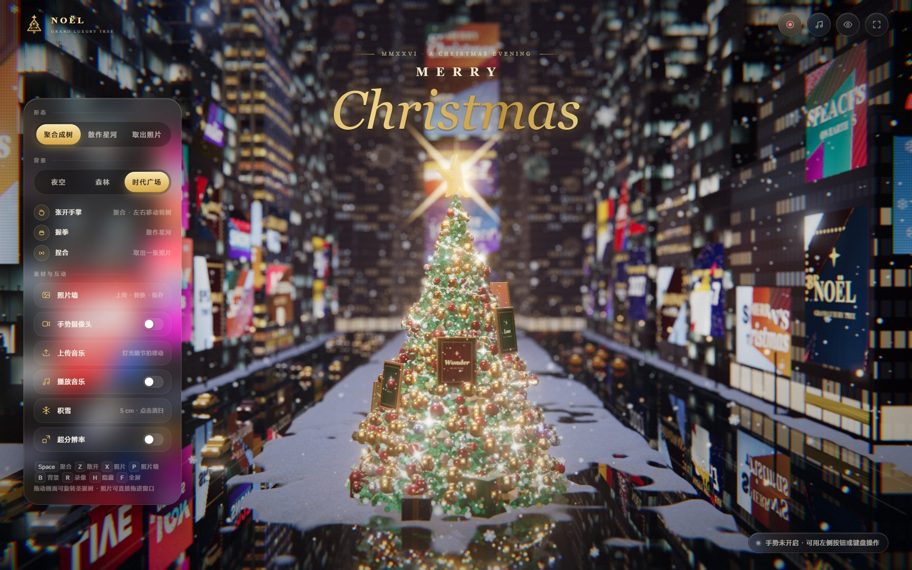
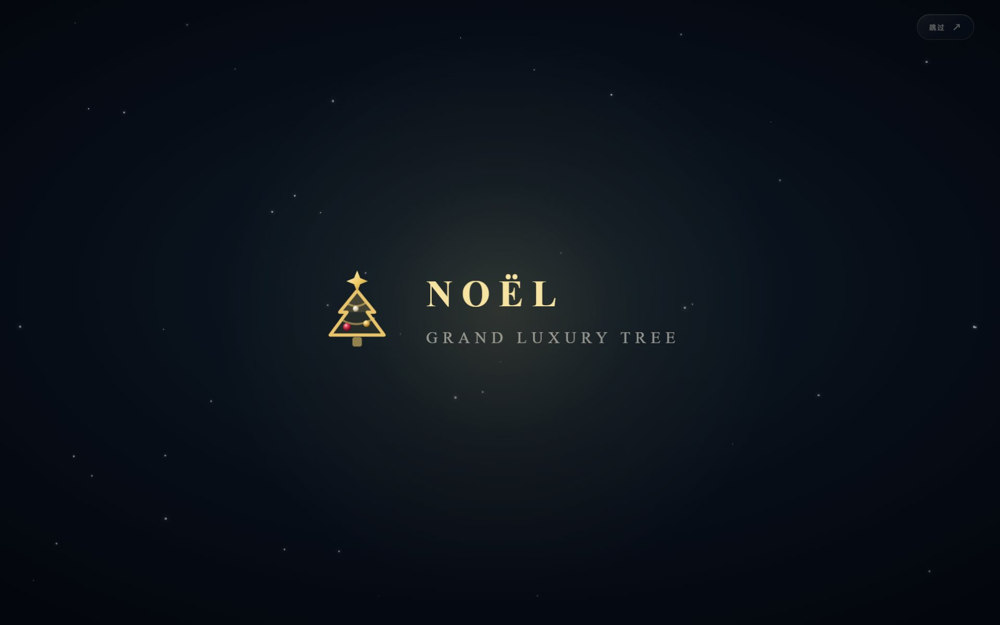
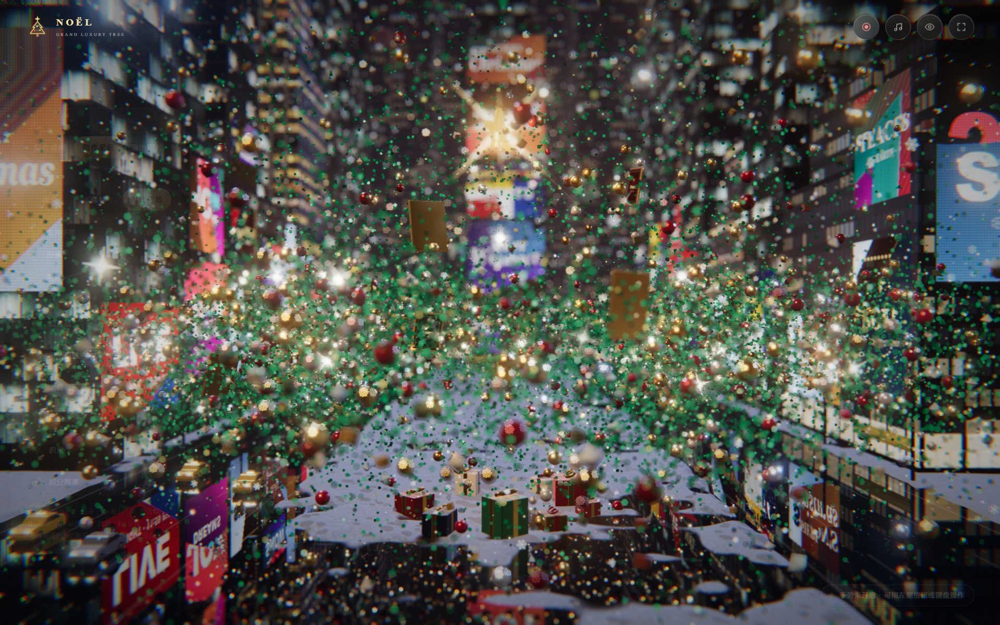
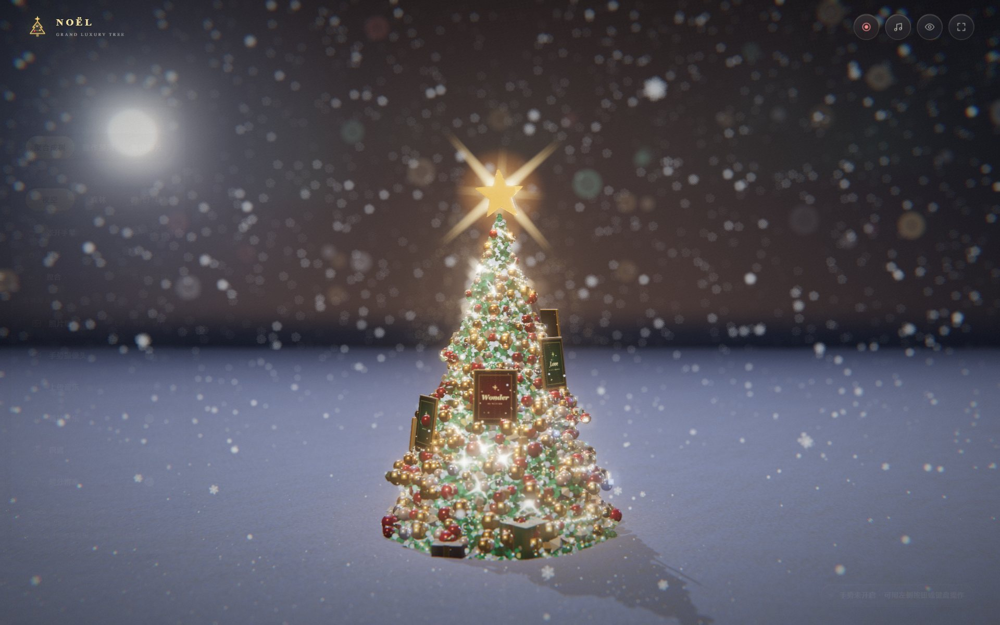
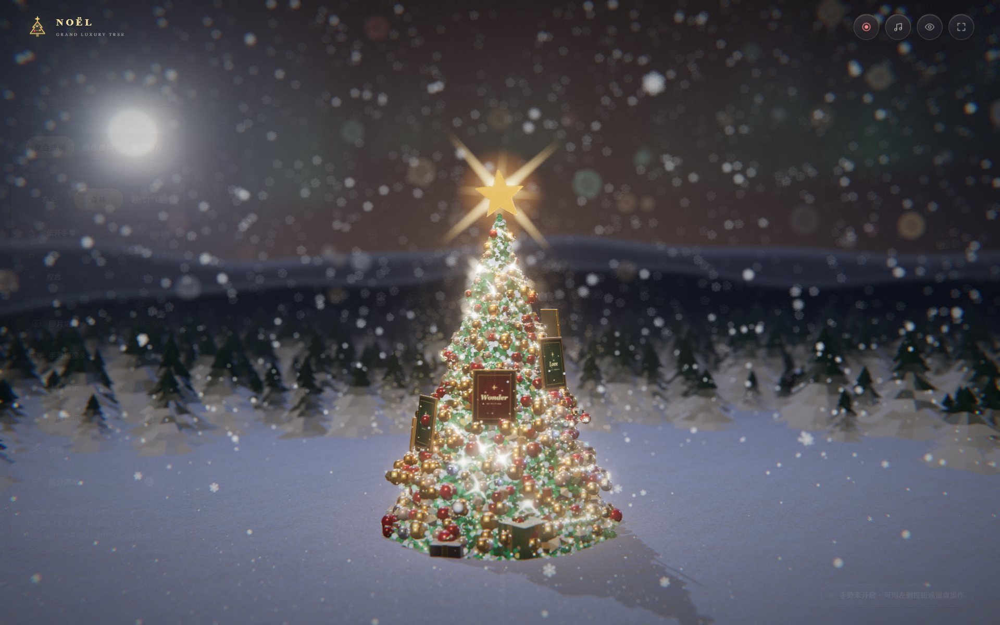
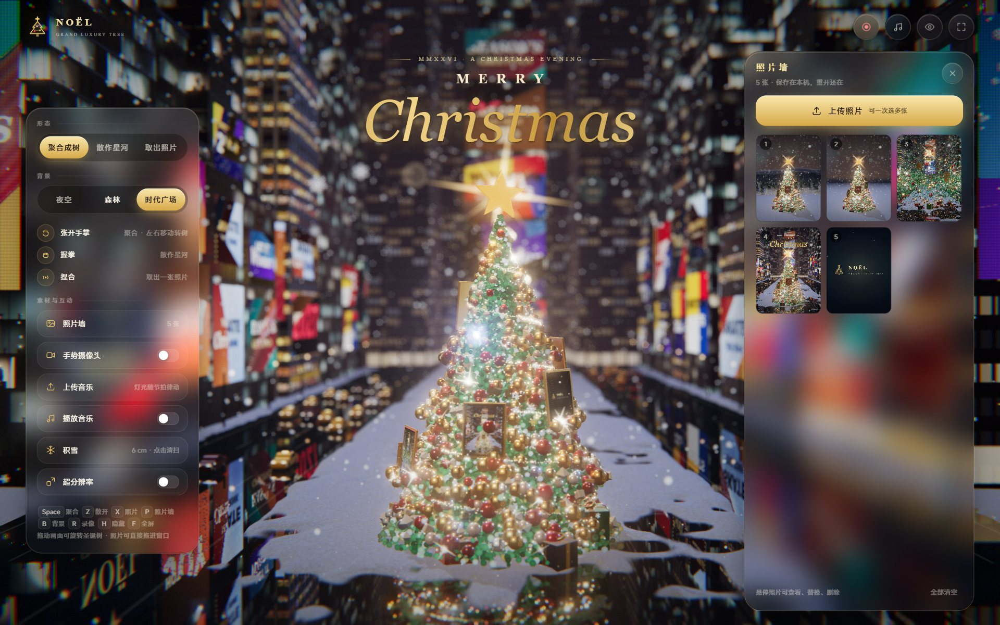
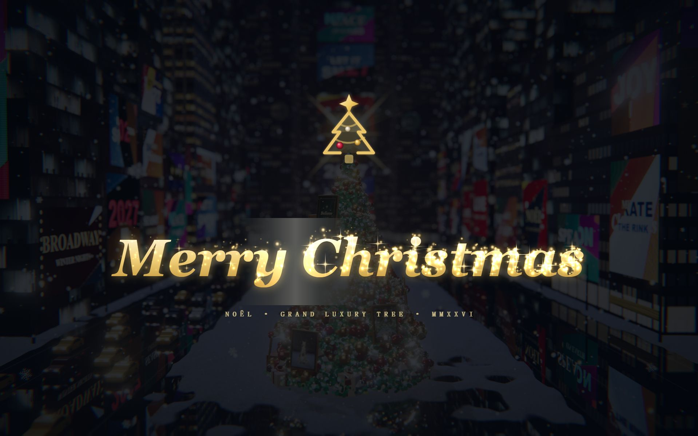
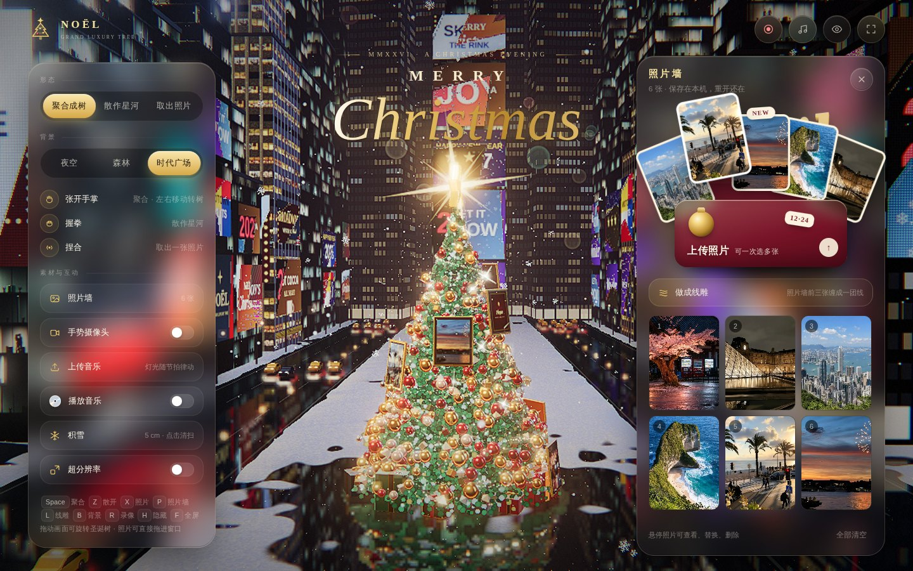

# Noël · 一棵会下雪的圣诞树



这棵树最早是今年一月随手写的一个小网页：几千个小方块堆成圆锥，握个拳就散开，张开手又聚回来。能跑，但是丑，而且一开摄像头就卡。

今天突然翻出来了，于是有了现在这个版本。它变成了一个正经的 Windows 小程序：打开是一段开场动画，然后你站在雪地里，面前一棵挂满金球和彩灯的大树，背后可以是安静的夜空、下雪的松林，或者灯牌闪成一片的纽约时代广场。

对着摄像头张开手，树就聚起来；握拳，它碎成一整片星河；捏一下手指，树上的一张照片会飘到你眼前。照片可以换成你自己的。

> 下载：[Releases 页面](https://github.com/shihshdh/noel-christmas-tree/releases/latest) 里的 `Noel_1.0.0_x64-setup.exe`，装完桌面上会多一个图标。

---

## 长这样

| 开场 | 散作星河 |
|---|---|
|  |  |

三种背景，左边中控里切，或者按 <kbd>B</kbd>：

| 夜空 | 雪松森林 | 时代广场 |
|---|---|---|
|  |  |  |

照片墙和录像片尾：

| 照片墙 | 录像片尾 |
|---|---|
|  |  |

照片墙的文件夹：



## 能玩什么

- **手势**：张开手掌是聚合成树，左右挪手能转树；握拳散成星河；拇指和食指一捏，取出一张照片。识别跑在单独的线程里，不跟画面抢时间。
- **照片墙**：一次选一堆照片上传，树上的相框会换成你的照片。单张可以替换、删除，关掉再开还在。照片多于 24 张时，树上会轮流换着挂。最新的五张插在一只丝绒文件夹里，只露出顶边；鼠标移上去，它们会带着一点回弹扇形展开，指到哪张哪张抬起来，点一下就把它从树上取到眼前。文件夹的前袋就是上传按钮。
- **录像**：点右上角的红点。先放一段片头，然后你随便用手势玩，点"结束"会放片尾：logo 描出来，Merry Christmas 一个字一个字亮起，每个字都带一小撮星光。摄像头画面会以小窗录在右下角，背景音乐也会一起录进去。客户端里存到 `D:\Noel\录像`。
- **积雪**：雪会一直下，地上越积越厚。在时代广场，车道上的雪会被车压化，路面湿亮，能倒映出大屏和车灯。积太厚了可以点"积雪"扫掉。
- **音乐**：可以上传一首歌，树上的灯会跟着低音一闪一闪；播放时中控里那张小光盘会转起来。

## 画面上花的功夫

我一开始的要求是"华丽、闪、高级"，最后做成了这样：

- 标题里的 Christmas 第一次出现时，会顺着书写方向一笔写出来；照片墙文件夹后面那行金箔气球字 Noël 也是。
- 树由一万多颗针叶粒子，加上金、红、珍珠、镜面四种挂饰，再加上水晶、小礼盒、灯串和光带组成。聚合和散开的动画全部在显卡里算，每颗粒子都有自己的节奏。
- 挂饰的反光是实时的：每隔几帧从树的位置拍一张周围的全景，所以金球里能看到时代广场大屏的颜色。
- 冰面是真的镜面反射，雪地上的每颗雪粒有自己的朝向，只有角度正好把灯光反射进你眼睛时才会一闪。
- 月光会投影；镜头有景深，焦点在树上，远处的楼和屏会虚成光斑。
- 时代广场的楼用的是 ambientCG 的真实夜景立面贴图，窗户里还能看到人影。大屏上是我自己画的节日海报，没有用真实品牌。
- 车是自己建的模型：黄色出租车、轿车，有车灯和出租车顶灯，在车道里会自动保持车距、走走停停。

## 怎么打开

**方式一：装客户端（推荐）**

在 [Releases](https://github.com/shihshdh/noel-christmas-tree/releases/latest) 下载安装包，双击就行，默认装在当前用户下，不需要管理员权限。

- 打开就是全屏，按 <kbd>F</kbd> 切回窗口。
- 双显卡的笔记本会自动用独显。
- 摄像头权限不会一直弹窗问你。
- 安装包没有代码签名，第一次打开 Windows 可能会说"已保护你的电脑"，点"更多信息 → 仍要运行"。

**方式二：用浏览器跑**

需要装 [Node.js](https://nodejs.org)。进 `html` 文件夹，双击 `启动圣诞树.bat`，它会在本地开一个小服务器并打开浏览器。摄像头必须走 `localhost` 才稳，所以不建议直接双击 `index.html`。直接双击也能看，只是手势模型要从 Google 下载，国内多半加载不出来。

## 操作

| 按键 | 作用 |
|---|---|
| <kbd>Space</kbd> | 聚合成树 |
| <kbd>Z</kbd> | 散作星河 |
| <kbd>X</kbd> | 取出一张照片 |
| <kbd>P</kbd> | 打开照片墙（照片也可以直接拖进窗口） |
| <kbd>B</kbd> | 切换背景 |
| <kbd>R</kbd> | 开始 / 结束录像 |
| <kbd>H</kbd> | 隐藏界面 |
| <kbd>F</kbd> | 全屏 |

鼠标拖动画面可以转树，拖动标题可以挪位置，双击标题复位。

## 关于显卡

写的时候是冲着 RTX 5070 Ti 笔记本去的：2560×1600 原生分辨率、全部特效开着，大概 80 帧，录像时 60 多帧。核显也能跑，程序会看帧率自动降档：先关体积光，再降反射精度，最后降分辨率并放大锐化。

左边有个"超分辨率"开关：先用 67% 的分辨率渲染，再放大锐化，思路和 FSR 1 一样，给显卡一般的电脑用。至于 DLSS，网页和 WebView2 都拿不到那个接口，这个没办法。

地址后面加 `?fps` 可以在右下角看到帧率、当前画质档和正在用的显卡。

## 自己改、自己打包

```
html/                 页面本体（一个 index.html），手势 Worker，本地服务脚本
  vendor/             three.js、MediaPipe 手势模型、立面贴图（都放在本地，不依赖外网）
noel-desktop/         Windows 客户端（Tauri 2 + 系统自带的 WebView2）
docs/screenshots/     README 里的截图
```

- **改页面**：改完直接刷新浏览器就能看到效果，页面就是一个 `index.html`。
- **打包客户端**：需要 Rust（stable，MSVC）和 Visual Studio C++ 生成工具。然后：

  ```sh
  cd noel-desktop
  npm install
  npm run build
  ```

  它会先把 `../html` 复制进来再打包，安装包在 `src-tauri/target/release/bundle/nsis/`。

## 已知的小毛病

- 手势在光线暗、手离镜头太远的时候会认不准。最好让整只手都在画面里。
- 照片墙存在程序自己的存储里，客户端和浏览器版是分开的，互相看不到。
- 浏览器版录出来的视频格式取决于浏览器：Chrome、Edge 是 MP4，别的浏览器可能是 WebM。
- 窗户里的人影是贴图自带的，整栋楼看久了能看出重复。

## 用到的东西

- [three.js](https://threejs.org)（MIT）：3D 渲染
- [MediaPipe Hand Landmarker](https://ai.google.dev/edge/mediapipe/solutions/vision/hand_landmarker)（Apache-2.0）：手势识别
- [ambientCG](https://ambientcg.com)（CC0）：时代广场的楼体立面贴图 Facade009 / 011 / 014 / 017
- [Tauri](https://tauri.app)：客户端外壳
- 字体 Cinzel、Cormorant Garamond 来自 Google Fonts（OFL），联网时加载，加载不到就用系统衬线体

代码用 MIT 协议，随便拿去改。要是你给家里人做了一棵，欢迎来 issue 里晒一下。

Merry Christmas 🎄
